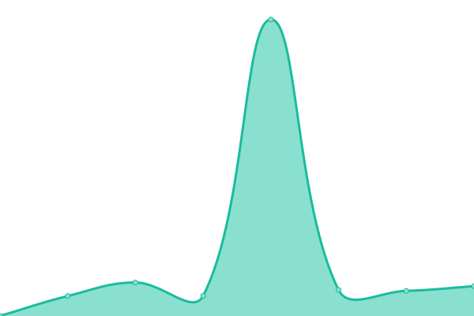
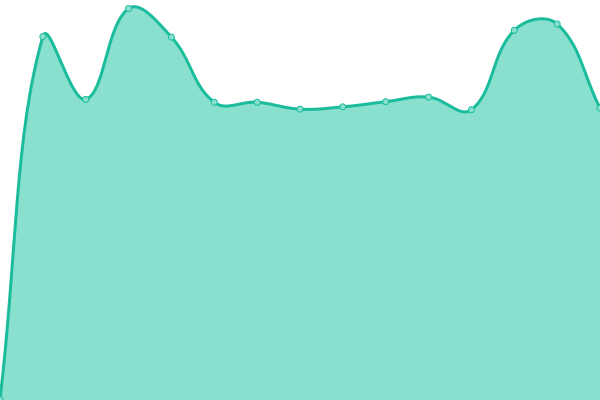
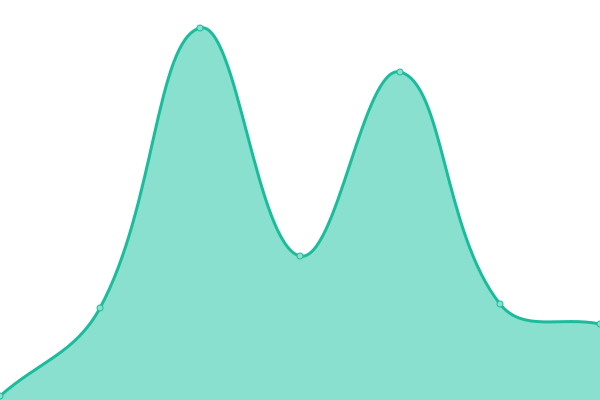
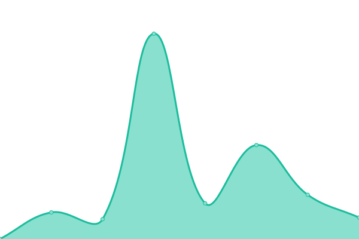

# [📈 Live Status](https://status.alru.ga): <!--live status--> **🟧 Partial outage**

<!--start: status pages-->
<!-- This summary is generated by Upptime (https://github.com/upptime/upptime) -->
<!-- Do not edit this manually, your changes will be overwritten -->
<!-- prettier-ignore -->
| URL | Status | History | Response Time | Uptime |
| --- | ------ | ------- | ------------- | ------ |
|  [Voyager](https://voyager.alru.xyz:8090) | 🟩 Up | [voyager.yml](https://github.com/DamienVesper/status.alru.ga/commits/HEAD/history/voyager.yml) | 

 186ms
     
 | 

<a href="https://status.alru.ga/history/voyager">0.00%</a>
    

|  [Apollo](https://apollo.alru.xyz:8070) | 🟩 Up | [apollo.yml](https://github.com/DamienVesper/status.alru.ga/commits/HEAD/history/apollo.yml) | 

 184ms
     
 | 

<a href="https://status.alru.ga/history/apollo">2.18%</a>
    

|  [Mercury](https://mercury.alru.xyz:8081) | 🟥 Down | [mercury.yml](https://github.com/DamienVesper/status.alru.ga/commits/HEAD/history/mercury.yml) | 

 600ms
     
 | 

<a href="https://status.alru.ga/history/mercury">0.00%</a>
    

|  [Excelsior](https://excelsior.alru.xyz:8080) | 🟩 Up | [excelsior.yml](https://github.com/DamienVesper/status.alru.ga/commits/HEAD/history/excelsior.yml) | 

 226ms
     
 | 

<a href="https://status.alru.ga/history/excelsior">0.00%</a>
    

|  [Xeno](https://xeno.alru.xyz:8080) | 🟥 Down | [xeno.yml](https://github.com/DamienVesper/status.alru.ga/commits/HEAD/history/xeno.yml) | 

 605ms
     
 | 

<a href="https://status.alru.ga/history/xeno">6.40%</a>
    

|  [Artemis](https://artemis.alru.xyz:8080) | 🟥 Down | [artemis.yml](https://github.com/DamienVesper/status.alru.ga/commits/HEAD/history/artemis.yml) | 

 595ms
     
 | 

<a href="https://status.alru.ga/history/artemis">0.00%</a>
    

|  [Gemini](https://gemini.alru.xyz:8080) | 🟩 Up | [gemini.yml](https://github.com/DamienVesper/status.alru.ga/commits/HEAD/history/gemini.yml) | 

 228ms
     
 | 

<a href="https://status.alru.ga/history/gemini">0.00%</a>
    

<!--end: status pages-->

[**Visit our status website →**](https://status.alru.ga)

## 📄 License

- Powered by: [Upptime](https://github.com/upptime/upptime)
- Code: [MIT](./.github/LICENSE) © [Alliance Reunited](https://alru.ga)
- Data in the `./history` directory: [Open Database License](https://opendatacommons.org/licenses/odbl/1-0/)
