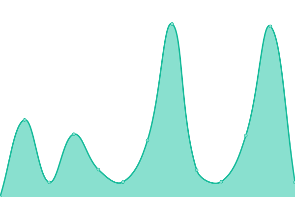

# [📈 Live Status](https://status.alru.ga): <!--live status--> **🟩 All systems operational**

This repository contains the open-source uptime monitor and status page for [Alliance Reunited](https://alru.ga), powered by [Upptime](https://github.com/upptime/upptime).

With [Upptime](https://upptime.js.org), you can get your own unlimited and free uptime monitor and status page, powered entirely by a GitHub repository. We use [Issues](https://github.com/Alliance-Reunited/share.alru.ga/issues) as incident reports, [Actions](https://github.com/Alliance-Reunited/share.alru.ga/actions) as uptime monitors, and [Pages](https://status.alru.ga) for the status page.

<!--start: status pages-->
<!-- This summary is generated by Upptime (https://github.com/upptime/upptime) -->
<!-- Do not edit this manually, your changes will be overwritten -->
<!-- prettier-ignore -->
| URL | Status | History | Response Time | Uptime |
| --- | ------ | ------- | ------------- | ------ |
|  [Website](https://www.alru.ga) | 🟩 Up | [website.yml](https://github.com/Alliance-Reunited/status.alru.ga/commits/HEAD/history/website.yml) | 

 816ms
     
 | 

<a href="https://Alliance-Reunited.github.io/share.alru.ga/history/website">100.00%</a>
    

|  [Forum](https://forum.alru.ga) | 🟩 Up | [forum.yml](https://github.com/Alliance-Reunited/status.alru.ga/commits/HEAD/history/forum.yml) | 

 1442ms
     
 | 

<a href="https://Alliance-Reunited.github.io/share.alru.ga/history/forum">100.00%</a>
    

|  [Panel](https://panel.alru.ga) | 🟩 Up | [panel.yml](https://github.com/Alliance-Reunited/status.alru.ga/commits/HEAD/history/panel.yml) | 

 446ms
     
 | 

<a href="https://Alliance-Reunited.github.io/share.alru.ga/history/panel">100.00%</a>
    

<!--end: status pages-->

[**Visit our status website →**](https://status.alru.ga)

## 📄 License

- Powered by: [Upptime](https://github.com/upptime/upptime)
- Code: [MIT](./LICENSE) © [Alliance Reunited](https://alru.ga)
- Data in the `./history` directory: [Open Database License](https://opendatacommons.org/licenses/odbl/1-0/)
